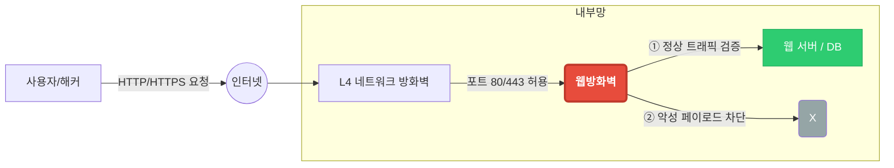
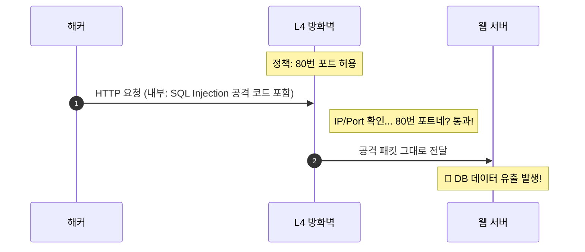
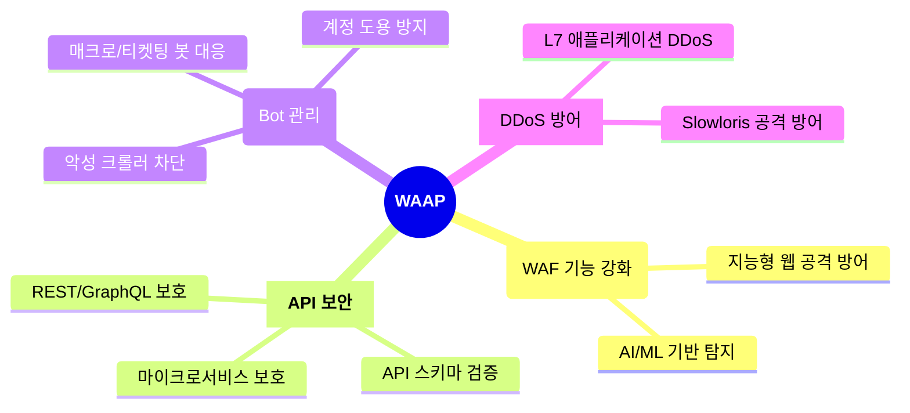

# 웹방화벽 (WAF)

## 1. 웹방화벽(WAF)이란?

### 정의

* **WAF (Web Application Firewall)**
* 일반적인 방화벽(Firewall)과 달리 **웹 애플리케이션(HTTP/HTTPS)**으로 향하는 트래픽을 감시하고 필터링하는 보안 시스템
* OSI 7계층 중 **Application Layer (Layer 7)** 에서 동작

### 핵심 역할

1. **해킹 방어:** SQL Injection, XSS 등 웹 공격 차단
2. **정보 보호:** 개인정보, 카드정보 유출 방지
3. **접근 제어:** 부정 로그인 및 비정상 트래픽(Bot) 제어

> **💡 핵심:** 방문객의 가방 속 내용물(패킷 데이터)까지 검사하는 '보안 검색대' 역할

---

## 2. 왜 WAF가 필요한가? (도입 배경)

### 기존 방화벽(Network Firewall)의 한계

* **IP/Port 기반 제어:** "누가(IP) 어디로(Port) 가는가"만 확인
* **Payload 분석 불가:** 패킷 안에 악성 코드가 심어져 있는지 확인 불가
* **웹 트래픽 허용:** 웹 서비스 포트(80, 443)는 항상 열려 있어야 하므로 무방비

### 웹 공격의 위험성

* **데이터 유출:** DB 해킹을 통한 고객 정보 탈취
* **서비스 마비:** 웹 서버 리소스 고갈
* **신뢰도 하락:** 홈페이지 변조 및 악성코드 유포지로 악용

---

## 3. 주요 방어 대상 (OWASP Top 10)

가장 빈번하게 발생하는 웹 취약점을 중점 방어합니다.

1. **SQL Injection (SQL 삽입):**
    * DB 쿼리를 조작하여 데이터 유출 및 삭제
2. **XSS (Cross Site Scripting):**
    * 악성 스크립트를 삽입하여 사용자 세션 탈취
3. **Broken Authentication (인증 취약점):**
    * 로그인 기능 우회 및 계정 탈취
4. **Security Misconfiguration:**
    * 서버의 기본 설정 미흡으로 인한 정보 노출

---

## 4. WAF vs IPS vs Firewall 비교

| 구분 | 방화벽 (Firewall) | IPS (침입방지시스템) | **WAF (웹방화벽)** |
| :--- | :--- | :--- | :--- |
| **대응 계층** | L3 / L4 (Network) | L3 ~ L7 | **L7 (Application)** |
| **판단 기준** | IP, Port | 패턴(Signature) | **URL, Parameter, Body** |
| **주요 목적** | 네트워크 접근 제어 | 웜, 바이러스 차단 | **웹 해킹 방어, 정보보호** |
| **HTTPS 검사** | 불가능 | 제한적 | **가능 (복호화 분석)** |

> **📌 요약:** 웹 공격(L7)을 막으려면 웹 전용 방화벽(WAF)이 필수

---

## 5. 동작 방식 및 배포 형태

## 동작 방식 (Filtering)

* **Blacklist (네거티브):** 알려진 공격 패턴만 차단 (관리 용이)
* **Whitelist (포지티브):** 허용된 안전한 접근만 통과 (보안성 높음)
* **Hybrid:** 위 두 방식의 혼합 (일반적)

## 배포 형태의 변화

1. **하드웨어형 (Appliance):** 고성능, 사내 구축 (비용 높음)
2. **소프트웨어형 (S/W):** 웹 서버에 직접 설치 (서버 부하 가능성)
3. **클라우드형 (Cloud WAF):** AWS, Cloudflare 등 (도입 쉬움, 트래픽 종량제)

---

## 6. 최신 트렌드: WAAP로의 진화

WAF는 이제 **WAAP (Web Application and API Protection)** 로 진화 중입니다.

## WAAP의 4대 핵심 요소

1. **WAF:** 전통적인 웹 공격 방어
2. **API Security:** 모바일/MSA 환경의 API 취약점 방어
3. **Bot Management:** 매크로, 크롤러, 디도스 봇 차단
4. **DDoS Protection:** L7(애플리케이션) 레벨의 디도스 방어

---
